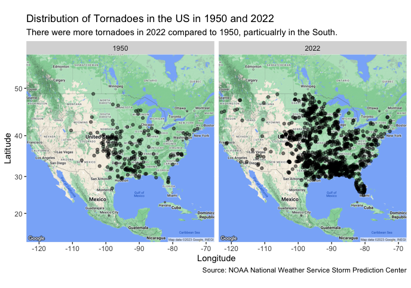
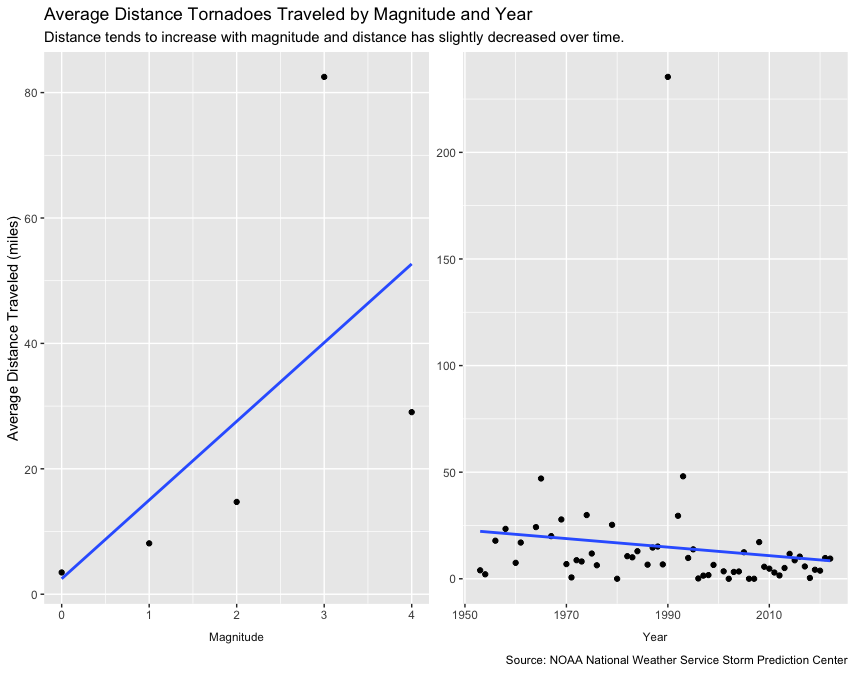

```{r, include = FALSE}
knitr::opts_chunk$set(
  collapse = TRUE,
  comment = "#>"
)

```

# US Tornado Trends

## Overview

This vignette utilizes data from [TidyTuesday](https://github.com/rfordatascience/tidytuesday/blob/master/data/2023/2023-05-16/readme.md#tornados) to explore the capabilities of the ggmap package. The data set, named tornadoes, originally comes from the NOAA National Weather Service Storm Prediction Center and it hosts information on US tornadoes since 1950. Some of the included variables are magnitude, state, year, and starting and ending coordinates. Check out the [data dictionary](https://github.com/rfordatascience/tidytuesday/blob/master/data/2023/2023-05-16/readme.md#data-dictionary) to see more.

With this data set and the ggmap package, I sought to answer the following questions:

-   How does the frequency and distribution of tornadoes in 2022 compare to 1950?
-   How does the distance traveled by a tornado relate to the magnitude and year?

```{r setup, message=FALSE, warning=FALSE}
library(ggmap)
```

```{r, message=FALSE, warning=FALSE}
library(tidyverse)
library(here)
```

```{r,message=FALSE, warning=FALSE, output = FALSE}

if (!dir.exists(here("~/Desktop/data"))) {
  dir.create(here("~/Desktop/data"))
}
if (any(!file.exists(here("~/Desktop/data", "tornadoes.RDS")))) {
  tornadoes <- readr::read_csv('https://raw.githubusercontent.com/rfordatascience/tidytuesday/master/data/2023/2023-05-16/tornados.csv')
  saveRDS(tornadoes, file = here("~/Desktop/data","tornadoes.RDS"))
} else {tornadoes <- readRDS(here("~/Desktop/data","tornadoes.RDS"))
}
```

## Distribution of Tornadoes 1950 vs. 2022

**NOTE!**

Spatial data for ggmap is obtained through GoogleMaps or StadiaMaps (depending on what "source" you choose), both of which require an API key. Before generating a map or using map related data, you must [register](https://mapsplatform.google.com/) for a key.

API keys are private and should be stored securely. Read [here](https://laurenilano.com/posts/api-keys/) for recommendations on how to protect your keys in an .Renviron file.

```{r message=FALSE, warning=FALSE, eval=FALSE}

ggmap::register_google("Your API Key")

US_map <- ggmap::get_map(location='united states', zoom=4, maptype = "terrain",
                  source='google',color='color')

tornadoes1950_2022 <-tornadoes %>%
  filter(year(date) %in% c(1950,2022))

ggmap::ggmap(US_map) +
  geom_point(
    aes(x=slon, y=slat),
    data=tornadoes1950_2022, alpha=.5, na.rm = T)  +
  scale_color_gradient(low="beige", high="blue") +
  facet_wrap("yr") +
  labs(x = "Longitude",
       y = "Latitude",
       title = "Distribution of Tornadoes in the US in 1950 and 2022",
       subtitle = "There were more tornadoes in 2022 compared to 1950, particualrly in the South.",
       caption = "Source: NOAA National Weather Service Storm Prediction Center")

```

{width="100%"}

## Frequency of Tornadoes 1950 vs. 2022

```{r fig.height=6, fig.width=8}
tornadoes %>%
  filter(year(date) %in% c(1950,2022)) %>%
  group_by(yr,st) %>%
  summarize(total = n()) %>%
  nest(data = c(st, total)) %>%
  mutate(data = map(data, ~ arrange(.x, desc(total)))) %>%
  unnest(cols=c(yr,data)) %>%
  group_by(yr) %>%
  mutate(st = factor(st),
         st = fct_reorder(st,total)) %>%
  slice(1:5) %>%
  ggplot(aes(st, total, fill = yr)) +
  geom_bar(stat="identity") +
  facet_wrap("yr", scales = "free_x") +
  theme(legend.position = "none") +
  labs(x="State",
       y = "Number of Tornadoes",
       title = "States with the Highest Number of Tornadoes in 1950 and 2022",
       subtitle = "MS and TX are tornado hotspots and the total number of tornadoes within top tornado states\nhas increased dramatically since 1950.",
       caption = "Source: NOAA National Weather Service Storm Prediction Center")
```

## Relationships between Distance Traveled by Tornado, Magnitude, and Year

```{r, eval = FALSE}
set.seed(123832)

distance_covered_loss <- tornadoes %>%
  select(om,yr,st,slat,slon,elat,elon,loss,mag) %>%
  filter(if_all(slat:elon) != 0) %>%
  drop_na() %>%
  slice_sample(n=150) %>%
  mutate(from = map2(slon,slat,~c(.x,.y)),
         to = map2(elon,elat,~c(.x,.y))) %>%
  mutate(distance = map2(from,to,~ggmap::mapdist(.x,.y, output="simple"))) %>%
  select(-c(from,to)) %>%
  unnest() %>%
  distinct()

distance_covered_loss %>%
  select(yr,miles,mag) %>%
  rename(Year = yr, Magnitude = mag) %>% 
  pivot_longer(-miles, names_to = "covariate") %>%
  group_by(covariate,value) %>%
  summarize(average_distance = mean(miles, na.rm = TRUE)) %>% 
  ggplot(aes(value,average_distance)) +
  geom_point() +
  geom_smooth(method="lm", se=FALSE) +
  facet_wrap("covariate", scales="free",strip.position = "bottom") +
  labs(y = "Average Distance Traveled (miles)",
       title = "Average Distance Tornadoes Traveled by Magnitude and Year",
       subtitle = "Distance tends to increase with magnitude and distance has slightly decreased over time.",
       caption = "Source: NOAA National Weather Service Storm Prediction Center") +
  theme(strip.placement = "outside",                     
        strip.background = element_rect(fill = "white"),  
        axis.title.x = element_blank())  

```

{width="100%"}

## Summary

Overall, this analysis revealed that there were more tornadoes in the US in 2022 than in 1950, and there was a substantial increase in frequency in the South. Among states with the most tornadoes, the total number of tornadoes occurring 2022 was much greater than the number of tornadoes occurring in 1950. This difference was about 90 tornadoes more per year in Texas alone. Lastly, this analysis showed that there seems to be a positive linear relationship between distance traveled by a tornado and its magnitude and a weakly negative relationship between distance traveled and year.

## Functions

-   **ggmap**: register_google(), get_map(), ggmap(), mapdist()
-   **dplyr**: group_by(), summarize(), filter(), select(), rename(), slice(), nest(), mutate()
-   **ggplot**: geom_point(), geom_bar(), geom_smooth()
-   **purr**: map(), map2()

